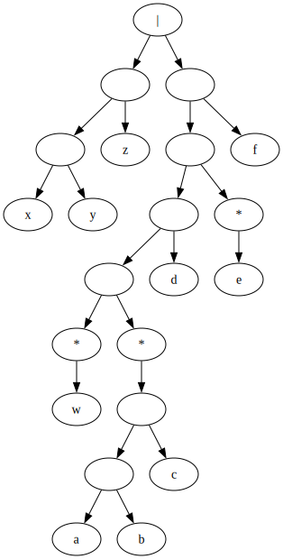

# zig-re
RegEx in Zig.

At the moment, parsing of basic RegEx's (literal characters, concatenation, `|`, and `*`) is implemented, with a Graphviz DOT output format.

Translation of regular expressions to $\varepsilon$-NFA to NFA to DFA is implemented and works in basic scenarios, but has some known bugs that are being worked on.

Example of a regex combining all current features: `xyz|w*(abc)*de*f`
AST:

<!-- TODO: include eps-NFA, NFA, DFA -->
