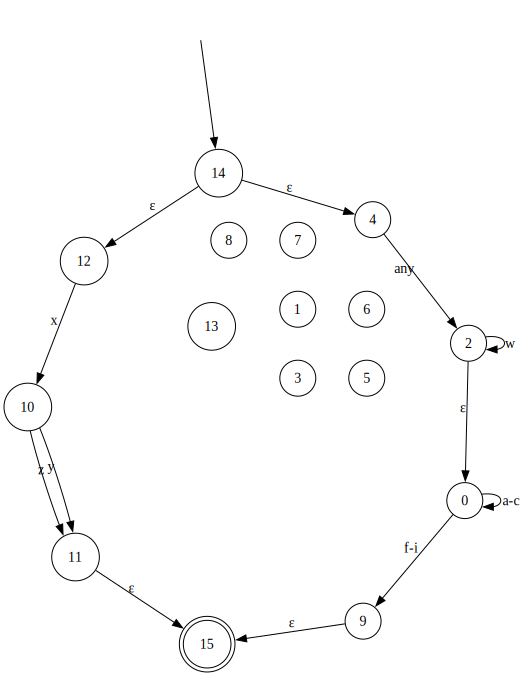

# zig-re
RegEx in Zig.

At the moment, parsing of basic RegEx's (literal characters, concatenation, `|`, and `*`) is implemented, with a Graphviz DOT output format.

Translation of regular expressions to $\varepsilon$-NFA to NFA to DFA is implemented and seems to work in somewhat complex scenarios, but is not tested extensively yet. Canonicalization of the final DFA is not implemented yet, and $\varepsilon$-NFA to NFA conversion is not very efficient yet.

The project also includes a JIT compiler for x86-64 that can convert DFAs to machine code that is executable immediately. Profile guided optimization is also implemented: the JIT compiler can use information collected during profiling runs of the DFA (pre-compilation, i.e. interpreted runs), to emit more efficient machine code. Although the compile-time performance of using this features is not great yet.

## Example
Example of a regex combining all current features: `xyz|w*(abc)*de*f`

AST:

$\varepsilon$-NFA:

NFA (still has the epsilon transitions, but they can all be ignored):

DFA:

## `comptime` ?
Building the DFA at compile-time should be possible quite easily [if/when Zig gets working compile-time allocators](https://github.com/ziglang/zig/issues/1291). It should also be possible now, but not without significant rewrites.
