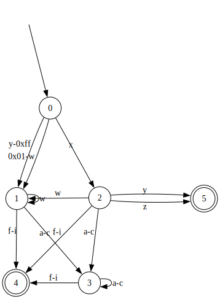

# zig-re
RegEx in Zig.

At the moment, parsing of basic RegEx's (literal characters, concatenation, `|`, and `*`) is implemented; `\` is used as an escaping character; parentheses can be used as you would expect. All other current features are merely syntactic sugar (as the previous features are enough to recognize any Type-3 language); here's a list of all the sweet stuff:
- Character ranges and groups: `[a-d]`, `[abcd]`, `[ab-d]`, `(a|b|c|d)` are all supported (and equivalent).
- Using `.` to mean "any character" is supported. To match a literal '.', use `[.]`.

Translation of regular expressions to $\varepsilon$-NFA to NFA to DFA is implemented and seems to work in relatively complex scenarios. Canonicalization of the final DFA is not implemented yet, and $\varepsilon$-NFA to NFA conversion is not very efficient yet.

The RegEx ASTs, and the NFAs and DFAs include Graphviz DOT output as a visualization aid.

The project also includes a JIT compiler for x86-64 that can convert DFAs to machine code that is executable immediately. Profile guided optimization is also implemented: the JIT compiler can use information collected during profiling runs of the DFA (pre-compilation, i.e. interpreted runs), to emit more efficient machine code. Although the compile-time performance of using this features is not great yet.

## Example
Example of a regex combining almost all current features: `x[yz]|.w*[a-c]*[f-i]`

AST:

$\varepsilon$-NFA:

NFA (still has the epsilon transitions, but they can all be ignored):

DFA:

Machine code can be found [here](assets/exampleMC.s)

## `comptime` ?
Building the DFA at compile-time should be possible quite easily [if/when Zig gets working compile-time allocators](https://github.com/ziglang/zig/issues/1291). It should also be possible now, but not without significant rewrites.
